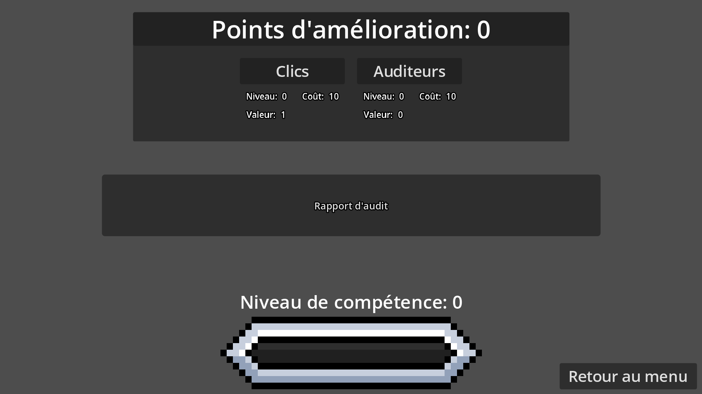
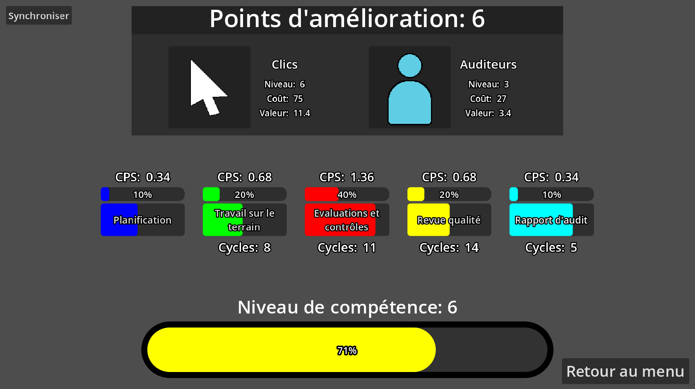
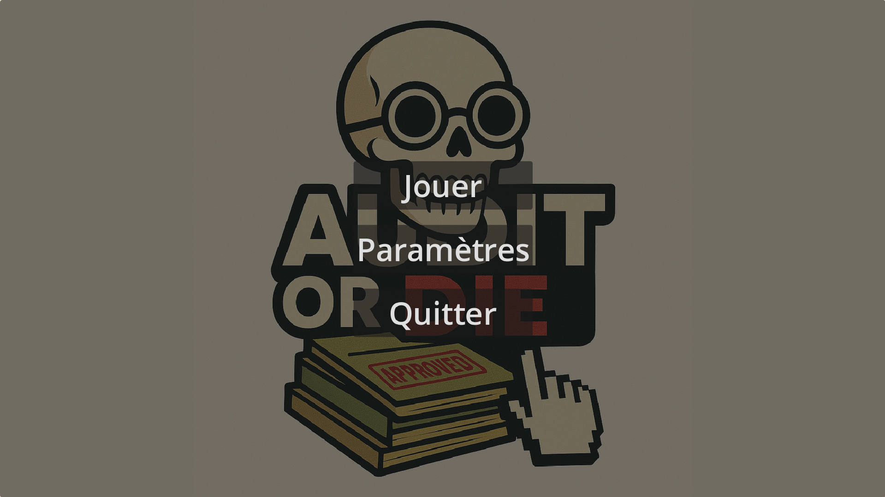

# Audit or Die 


## Présentation du projet

**Audit or Die** est un **Clicker incrémental**, où vous devrez gérer et faire grandir un **cabinet d’audit**. Le jeu est principalement destiné aux étudiants en première année de BUT Informatique, afin de les sensibiliser aux **enjeux de l’audit interne et à la valeur du métier d’auditeur**.

## Captures d'écran

Begining UI

Endgame UI

Main Menu


## Procédures d'installation et d'exécution

### 1 - Téléchargement
Veuillez télécharger la dernière version du jeu depuis la section **[Releases](https://github.com/D-l-E-G-O/Audit-or-Die/releases)** du dépôt GitHub.

Choisissez l’archive correspondant à votre système d'exploitation :

- **Windows** : Windows.zip

- **Linux** : Linux.zip

### 2 - Extraction des fichiers
Suivez les instructions du fichier INSTALL.md présent dans l'archive téléchargée.

### 3 - Lancement du jeu
- **Windows**

	Double-clique sur :
	```bash
	AuditOrDie.exe
	```

- **Linux**

	Entrez la commande suivante :
	```bash
	./AuditOrDie.x86_64
	```
